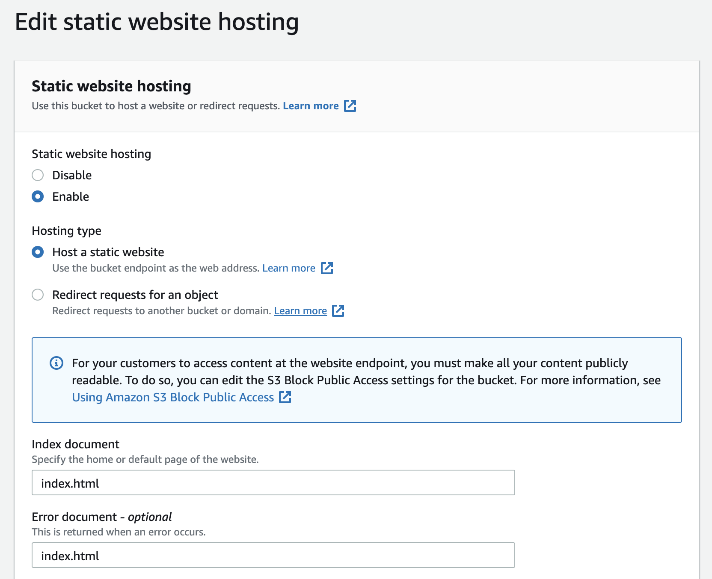

프론트엔드 개발을 시작하기에 참 편한 시대이지만, localhost에서만 작동하는 서비스는 서비스로서 전혀 의미가 없다. 프론트엔드 서비스가 사용자에게 서비스로서 다가가기 위해서는 _서비스에 걸맞는 도메인 이름_, 도메인으로 접근했을 때의 _빠른 첫 화면 표시_, _오류 없는 구동_, _HTTPS를 통한 안전한 통신 보장_ 등 갖추어야 할 조건이 상당히 많다. 많은 부분을 최소한의 설정으로 쉽게 해결해주는 vercel, netlify, github pages와 같은 SaaS 서비스들이 있지만, 이런 서비스들은 개발자나 사용자들의 요구사항에 맞게 조작하기엔 한계가 있기 마련이다. AWS는 자타공인 최고의 IaaS 서비스로, 프론트엔드뿐만 아니라 웹서비스의 개발을 위한 거의 모든 도구들을 최상의 자유도로 제공한다. netlify, vercel과 같은 서비스들이 이름표만 다르게 붙인 완성 제품을 찍어내는 느낌이라면, AWS는 아주 작은 부품까지 따로 포장하여 개발자가 스스로의 용도에 맞게 조립하기를 요구한다고 볼 수 있다. 높은 자유도가 주어진 만큼 그에 따른 책임으로 AWS를 배우는 것은 다른 SaaS들과 비교하면 차원이 다를 정도로 어렵고 방대하다.

필자에게 프론트엔드 서비스를 어떻게 배포할 것이냐고 묻는다면, 대다수의 경우 AWS를 고를 것이다. 그리고 누군가가 배포 방법을 알려달라고 하면, netlify를 추천해 줄 것이다. 필자 역시 storybook이라든지 간단한 웹앱 데모를 띄운다고 하면 netlify를 사용한다. 그러나 SaaS를 시용하던 개발자가 불편함을 느껴 AWS로 이전해야 할 필요성을 느꼈다면, AWS를 이용한 배포를 배우는 것은 시간은 오래 걸릴지언정 프론트엔드뿐만 아닌 전반적인 컴퓨터과학적인 지식의 학습 혹은 복습의 기회가 될 것이고, 실제 서비스의 인프라에 대해 더욱 깊게 이해할 수 있는 기회가 될 것이다. 본 글은 두 파트로 나누어 필자가 실제로 AWS에 어떤 식으로 생산 단계 프론트엔드 웹앱을 배포하는지를 설명한다. 마침 필자도 AWS 계정을 이전하고 있던 터라 랜딩 페이지를 다시 배포하며 해당 과정들을 설명해보도록 하겠다.

# Prerequisities

Part 1의 목표는 다음과 같다:

- AWS S3에 사이트의 정적 파일 및 자산 업로드
- AWS S3 버킷에 정적 웹사이트 호스팅 및 공개 액세스 설정
- GitHub Actions로 코드 변화에 따라 자동으로 배포 업데이트

본 글에서 독자가 알고 있다고 가정하는 개념들은 다음과 같다. 만약 해당 개념들에 대한 이해가 부족하다고 생각된다면, 다른 SaaS를 먼저 사용해 보는 것을 추천한다.

- 정적 웹사이트 호스팅
- CI(지속적 통합) / CD(지속적 배포)

그리고 다음 사항들을 기본적으로 가지고 있다고 가정하겠다.

- GitHub 계정
- 프론트엔드 코드를 올리는 GitHub 레포지토리
- AWS 계정

# Background

## AWS S3

S3는 Simple Static Storage, 즉 간단한 정적 저장소로, AWS에서 정적 리소스를 다룰 때 가장 권장되는 방법이다. 리소스에 대한 공개적 접근을 염두에 두고 설계되어 있으며, 웹사이트를 배포할 경우 기반이 되는 HTML 파일 - 거의 예외 없이 index.html - 을 바탕으로 정적 웹사이트를 배포할 수 있다. 이외에도 미디어 파일을 다루는 서비스의 저장소나 서버 로그를 저장하는 저장소 등으로 사용할 수 있다.

## GitHub Actions

GitHub Actions는 GitHub에 내장된 CI/CD로, 레포에 특정 이벤트 - push, PR 등 - 가 발생했을 때 정의된 작업을 수행한다. 본 글에서는 웹사이트를 빌드하여 AWS S3에 업로드하는 것까지를 액션으로 작성할 것이지만, 올라온 PR의 코드 상태를 체크하거나, 테스트를 수행하고 커버리지를 기록한다던가 하는 일반적인 작업들을 아주 쉽게 설정하여 사용할 수 있다.

# Steps

## Deploy Static Site on S3

### 1. Create S3 Bucket


먼저 S3 콘솔로 가서 버킷을 만든다. **버킷**은 S3 내에서 저장소를 구분하는 가장 큰 단위이다. 버킷에 디렉토리 및 객체들이 종속되며, 해당 객체들에 대한 권한이나 접근 제어도 일괄적으로 설정된다. 버킷의 이름은 서비스명, 또는 희망하는 서비스의 도메인과 유사하게 작성하면 된다. 해당 이름은 URL로 사용 가능해야 하며 - 즉 하이픈이나 점 등 일부 특수문자와 영소문자로만 이루어져야 하며, 세계의 모든 AWS S3 버킷들을 통틀어 유일해야 한다. 버킷을 생성하고 생성된 버킷을 클릭하면 해당 버킷의 콘솔로 진입한다.


### 2. Build & Upload to S3

이제 작성한 코드를 생산(production) 모드로 빌드할 것이다. 프레임워크를 사용했다면 일반적으로 package.json에 빌드 스크립트가 존재한다. gatsby를 사용한 경우 `gatsby build`, next를 사용한 경우 `next build`, CRA를 사용했다면 `react-scripts build`와 같은 형태일 것이다. 물론 React 패밀리 외의 타 프레임워크/라이브러리들도 빌드 스크립트는 거의 기본적으로 제공해 줄 것이다. 직접 컴파일러와 번들러를 설정했다면, 빌드 스크립트는 꼭 package.json 안에 만들어두는 것이 좋다. 빌드를 통해 만들어지는 디렉토리 이름을 기억하고, 해당 디렉토리에 index.html이 존재하는지 확인하자. 일반적으로 public, static, dist 등의 이름을 가지며, gatsby의 경우 public 디렉토리가 생성된다.

이제 해당 디렉토리의 내용물을 AWS S3 버킷에 업로드하자. 파일 탐색기에서 버킷 콘솔의 객체 탭에서 드래그&드롭으로 끌어놓기만 해도 디렉토리 구조를 그대로 보존한 채로 업로드될 것이다. 여기까지 끝나면 일단 첫 단계는 마무리된 것이다. 당신의 서비스는 업로드는 되었지만, 공개적으로 접근할 수 없고 정적 웹사이트로서 기능하지도 않는다. 몇 가지 설정으로 해당 기능들이 작동하도록 해보자.

### 3. Setup S3 Static Website Hosting

이제 S3 콘솔의 Properties로 가서 맨 밑으로 스크롤해보면, **정적 웹사이트 호스팅** 항목이 존재한다. 버킷의 기본 설정은 정적 호스팅을 불허하기 때문에, 이를 허용해주어야 한다. 설정을 변경하여 정적 호스팅을 활성화하자. 핵심은 **인덱스와 에러 모두 index.html로 향하도록 설정**되어야 한다는 것인데, 만약 별도의 에러 HTML 파일이 존재한다면 그 파일의 이름을 사용하는 것이 맞겠지만 일반적으로 SPA 앱들은 index 도큐먼트로 에러를 포함한 모든 경로를 표현한다.



활성화하고 나면 아래와 같이 AWS에서 배정한 버킷 이름을 포함한 도메인으로 웹사이트가 접근 가능하다고 나올 것이다.


하지만 해당 URL로 접근하면 Access Denied와 유사한 메시지를 보게 될 것이다. 이는 정적 웹사이트는 배포가 되었지만 별도의 인증 없이 객체에 접근하는 공개 접근이 아직 불허되어있기 때문이다. 권한을 허가하기 위해 버킷 설정을 조금 더 만져줘야 한다.

### 4. Allow Public Access to S3

먼저 버킷의 객체들에 대한 공개 접근을 허용한다. 버킷 콘솔의 권한 탭으로 이동하여 공개 접근 설정으로 가서 **모든 공개 접근을 허가**한다. 모든 접근을 허가하면 AWS가 해당 작업이 위험할 수 있다고 경고할텐데, 애초에 목적이 공개된 정적 사이트를 배포하는 것이므로 신경쓰지 말고 허가한다. 허가하고 나면 다음과 같은 상당히 위험해보이는 표시들이 나타난다.


그리고 마지막으로 GetObject 작업에 대해서 공개 접근을 허가한다는 정책을 추가해야 한다. 사실 개인적으로 이 과정이 매우 불편하고 불필요하다고 생각하지만, AWS 내부적으로는 객체에 대한 요청 권한과 HTTP GET 요청을 통한 접근 권한이 별도로 관리되기 때문이라고 추측하고 있다. 바로 밑의 버킷 정책 항목을 들어가서, 아래 내용에서 `YOUR-BUCKET-NAME`만 버킷 이름으로 변경하고 그대로 붙여넣는다.

```json
{
  "Version": "2012-10-17",
  "Statement": [
    {
      "Sid": "PublicReadGetObject",
      "Effect": "Allow",
      "Principal": "*",
      "Action": "s3:GetObject",
      "Resource": "arn:aws:s3:::YOUR-BUCKET-NAME/*"
    }
  ]
}
```

변경하고 나면 아래와 같이 정책이 적용될 것이다.


모든 설정이 제대로 끝났다면, 아까 주어졌던 정적 웹사이트 호스팅 URL로 접근하면 localhost에서 보던 웹서비스가 그대로 구동하고 있어야 한다.


대문짝만한 Not Secure 딱지, 너무 장황한 도메인 이름 등 불편한 점이 조금 있지만 지금은 그냥 넘어가도록 하자. 해당 내용들에 대해서는 Part 2에서 다룬다.

## Continuous Deployment w/ GitHub Actions

사이트가 뜬 것까지는 좋은데, 코드에 업데이트가 있을 때마다 파일을 로컬에서 빌드하고 버킷을 비우고 드래그해서 새 정보를 채워넣는 작업은 상당히 번거로워 보인다. 코드의 업데이트에 따라 자동으로 빌드 스크립트를 실행하고, 빌드로 생성된 디렉토리를 S3와 동기화하여 자동으로 변경된 웹앱을 배포할 수 있다면 배포 부담을 크게 줄일 수 있을 것이다. 지속적 배포(Continuous Deployment, CD)는 해당 기능을 수행하는 서비스를 정의하는 단어로, Travis, Circle, GitLab CI 등 수준 높고 간편한 서비스들이 아주 많다. 하지만 우리는 GitHub에서 별도의 설치 없이 레포 생성만으로 내장되는 GitHub Actions를 사용하기로 한다. 액션은 GitHub에 내장되어 있을 뿐만 아니라 설정의 편리성, 비교적 자유로운 runner 선택 등 여러 면에서 아주 좋은 CI/CD이다.

### 5. Create AWS IAM for GitHub Actions

CD가 배포 작업을 수행할 수 있도록 하기 전에, 먼저 액션이 AWS S3에 접근할 방법이 있어야 한다. AWS는 프로그램적인(programmatic) 자원 접근과 콘솔을 통한 자원 접근을 모두 지원한다. 그러나 일반적으로 콘솔에 로그인할때 쓰는 루트 계정으로 프로그램적 접근을 허가하는 것은 그다지 지혜로운 생각은 아니다. 해당 계정은 AWS의 모든 자원에 최상위 권한으로 접근이 가능하기 때문에, 유출되면 서비스 해킹뿐만 아니라 심각한 금전적 손해를 입을 수도 있다. 따라서 CD 등 특정 작업만을 위한 계정을 별도로 생성하여 해당 계정의 비밀 키를 1회성으로 생성 후 잊는 것이 가장 안전하다. AWS에서는 IAM을 통해 이를 달성할 수 있다.


IAM 콘솔로 진입하여 유저 생성을 클릭한다. 유저 이름은 S3에 대한 배포를 관리하므로 필자는 `s3-deploy-manager`로 하였다. 접근 방식은 프로그램적 접근으로 한정하자. 해당 계정으로 콘솔에 진입할 일이 없다면, 애초부터 불허하는 것이 보안적으로 좋다.


이제 유저에게 S3에 대한 접근 권한을 부여한다. 선택지들 중 이미 있는 정책 가져오기를 고르고 `AmazonS3FullAccess`를 검색하여 선택한다. 조금 더 안전하게 하려면 S3 중에서도 배포하려는 버킷 하나만을 지목하여 sync 작업만을 허용하도록 해야 하지만, 그렇게까지 하기에는 너무 귀찮으므로 따로 설명하지 않는다.


유저 생성이 완료되면 access key와 secret key가 담긴 csv 파일을 다운로드할 수 있다. **해당 파일은 페이지를 벗어나면 영원히 다시 받을 수 없으므로 주의하자.**(사실 새 key pair를 생성하면 된다) csv 파일을 다운로드했다면, GitHub으로 가서 해당 인증 정보들을 업로드해야 한다. GitHub의 코드를 업로드하는 레포지토리의 설정으로 가서, Secrets 탭으로 들어간다.


여기에 `AWS_ACCESS_KEY_ID`, `AWS_SECRET_ACCESS_KEY` 이름으로 두 개의 repository secret을 생성하고, csv 파일 안에서 해당하는 칸의 내용을 그대로 붙여넣는다. secret이 저장되었다면 csv 파일은 파기해도 좋으며, 파기하는 것이 오히려 보안상 이롭다. 이제 해당 이름으로 액션 내에서 환경변수로서 접근이 가능하며, 우리는 이를 이용해 AWS CLI에 로그인하도록 설정할 것이다.

### 6. Automated Deployment w/ GitHub Actions

이제 액션을 세팅하는 것은 케이크를 먹는 것보다 쉽다. 프로젝트의 루트 디렉토리에 `.github/workflows/` 디렉토리들을 만들고, 여기에 액션의 이름으로 yml 파일을 하나 생셩한다. 필자의 경우 `deploy.yml`로 설정하였다. 해당 yml 파일에 들어가야 할 내용들은 액션 도큐멘테이션을 참고하도록 하자. 핵심 포인트는 **미리 정의되어있는 액션의 일부분을 끌어와 사용할 수 있다**는 것인데, 예를 들면 node에서 정의한 액션을 통해 액션을 실행하는 runner 안에 특정 버전의 node를 설치할 수도 있고, 주어진 환경변수를 기반으로 AWS CLI를 특정 IAM 인증 정보로 시작할 수도 있다.

아래는 필자가 일반적으로 사용하는 프론트엔드 액션의 정의로, 체크아웃 > `node_modules` 캐싱(빌드 시간을 크게 단축해준다) > AWS CLI 설정 > NodeJS 설정 > 의존성 설치 > 빌드 > 배포 순으로 구성되어 있으며, master 브랜치에 push할 때마다 작동되도록 설정되어 있다. 필자는 여기에 type check, lint, test 등을 주로 추가하여 사용한다. `YOUR-BUILD-DIR`, `YOUR-BUCKET-NAME`만 주의하여 자신만의 액션을 만들어보자.

```yml
name: Deploy

on:
  push:
    branches:
      - master

jobs:
  deploy:
    runs-on: ubuntu-latest
    steps:
      - uses: actions/checkout@v2
      - name: Cache modules
        uses: actions/cache@v1
        id: yarn-cache
        with:
          path: node_modules
          key: ${{ runner.os }}-yarn-${{ hashFiles('**/yarn.lock') }}
          restore-keys: ${{ runner.os }}-yarn-
      - name: Configure AWS credentials
        uses: aws-actions/configure-aws-credentials@v1
        with:
          aws-access-key-id: ${{ secrets.AWS_ACCESS_KEY_ID }}
          aws-secret-access-key: ${{ secrets.AWS_SECRET_ACCESS_KEY }}
          aws-region: ap-northeast-2
      - name: Use Node.js 12.x
        uses: actions/setup-node@v1
        with:
          node-version: 12.x
      - name: Install dependencies
        run: yarn
      - name: Build
        run: yarn build
      - name: Deploy
        run: aws s3 sync ./YOUR-BUILD-DIR s3://YOUR-BUCKET-NAME
```

모두 완료되었다면, 이제 변경사항을 master 브랜치에 push한다. 남은 건 GitHub 레포지토리의 Actions 탭에서 배포가 제대로 진행되는지 확인하는 것 뿐이다.


# Summary

이상 S3와 GitHub Actions를 이용한 정적 사이트 배포를 알아보았다. Part 2에서는 커스텀 도메인 이름과 CDN을 통한 전지구적 배포 및 캐싱에 대해 다룰 것이다. Part 2가 훨씬 어려우므로 마음의 준비를 하자!
