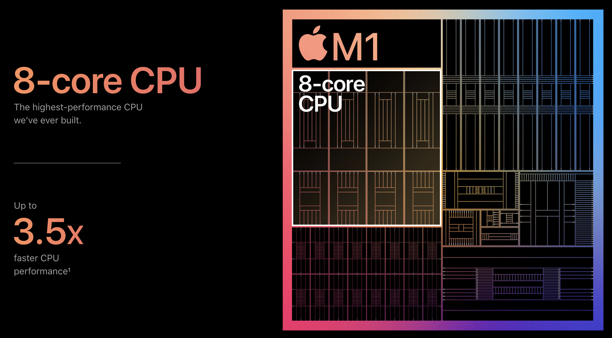
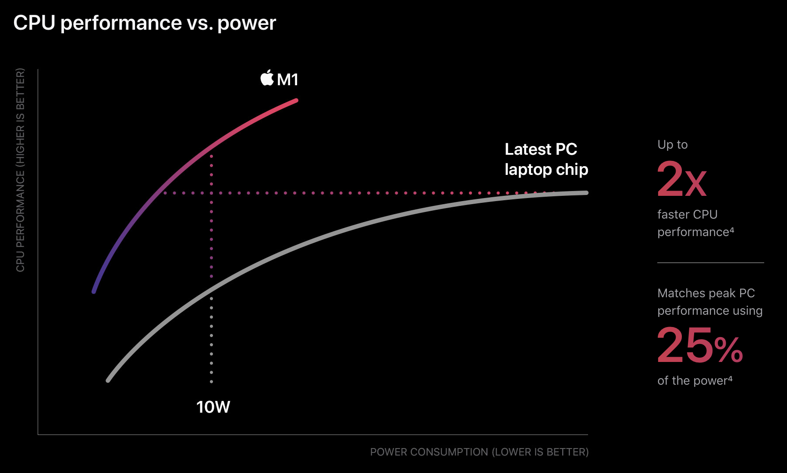

최근 애플은 자사의 플래그십 노트북 라인업인 맥북의 프로세서를 인텔 제품에서 자사가 자체 제작하는 Apple Silicon으로 교체하겠다고 발표했다. 많은 IT 종사자들에게 충격을 준 이슈였고, 사람들은 새로운 프로세서를 탑재하고 출시될 맥 라인업을 ARM 맥이라고 부르며 여러 작업에 대한 벤치마크 결과나 기존 애플리케이션들의 호환성을 공유하기 시작했다. 필자는 소프트웨어 개발자이지만 하드웨어에 관심이 많은 사람으로서 프로세서나 CPU 아키텍쳐에 대한 지식이 없다면 궁금해할만한 점들, 왜 ARM 맥이라고 부르는지, 왜 성능, 전성비, 호환성 이야기가 나오는지, 왜 이 전환이 컴퓨터 시장에서의 대담한 발걸음인지에 대해 써보려고 한다.

이 글에서는 먼저 가볍게 현대 프로세서의 발전 과정에 대해 알아보고 현재 경쟁하고 있는 거대 제조사들과 아키텍쳐에 대해 알아볼 것이다. 그리고 글의 말미에는 공개된 ARM 맥에 대한 정보들과 앞으로 프로세서 시장이 어떻게 나아갈 것인지 간단하게 고찰해 볼 것이다.

# CPU와 그 성능에 대해

CPU의 성능을 나타내는 지표들은 아주 다양하다. flops, 몇 나노 공정, 클럭, 레이턴시, IPC, 코어 개수, 캐시 크기, 레지스터 크기, 전성비, 가성비 등등... 그러나 완성된 CPU를 사용하는 소비자들에게 "CPU의 성능이 이렇게나 좋다"고 어필할 때는 저런 지표들보다 실제로 애플리케이션들을 실행했을 때 같은 작업을 얼마나 빨리, 부드럽게 실행할 수 있는지가 중요할 것이다. 저러한 지표들은 최종 애플리케이션 퍼포먼스의 목표치를 달성할 때 상호 보완적으로 작용한다. 예를 들어, 반도체 공정의 한계로 동일 조건 하에서 클럭을 더이상 올릴 수 없는 상황이라면 제조사들은 전압을 높이거나(오버클럭), 캐시 또는 레지스터의 크기를 키우거나, 코어 수를 추가하거나, 구조 개선 또는 메모리 오버클럭으로 메모리 레이턴시를 줄일 수 있다.

모든 지표들이 지향하는 바는 비슷하지만, 그것을 실제로 달성하는 과정은 천차만별이다. 이를 이해하기 위해 CPU의 제조 과정에 대해서 간단하게 알아볼 것이다.

## CPU의 제조 과정

과거에는 한 기업이 CPU 생산을 처음부터 끝까지 전담하는 경우도 많았지만, 현재에는 각 분야의 기술력이 너무나 고도화되고 연구에 들어가는 비용도 천문학적으로 증가함에 따라 여러 기업들이 CPU 생산 과정 중 일부를 전담하여 최종 생산 기업으로부터 수주를 받는 형태로 변모하였다. 물론 인텔이나 삼성 모바일 AP 사업부처럼 한 기업 내에서 모든 과정을 해결하는 기업들도 여전히 존재한다.

[^1]

### 1. 파운드리

먼저 실제로 반도체를 생산하는 파운드리 기업들이 있다. 이들은 팹(fab)이라고 불리는 클린룸 생산 시설을 갖추고 있으며, 수주받은 설계도를 바탕으로 단결정 실리콘 웨이퍼(wafer)에 회로를 새긴다. 파운드리들이 사용하는 모든 장비와 자재, 화학약품들은 초고순도여야만 하며, 순도가 소수점 한 자리씩 떨어질 때마다 불량률은 기하급수적으로 증가한다.

자재를 생산, 관리하고 수주받은 수 nm 단위의 회로를 오류 없이 새겨내고 완성된 웨이퍼를 손상 없이 공급하는 과정은 단순히 재료공학, 전자공학의 영역을 넘어 양자역학 등의 최신 자연과학 지식들까지 요구한다[^2]. 이러한 지식들을 R&D로 쌓고 한 건물당 수 조 원씩 하는 팹을 건설하고 경쟁 업체들로부터 수주를 따내는 일은 세계를 호령하는 대기업들도 꺼리는 도전이기 때문에 파운드리 시장은 전통 강호 두 기업 - TSMC와 삼성전자 - 의 과점이다. 인텔은 자사 팹을 운영하고 있지만, 최근 몇 년동안 붕괴된 R&D 팀을 회복하지 못하고 타사 파운드리에 생산을 맡길 것이라는 전망이 나오고 있다.

파운드리가 CPU의 성능에 주는 영향은 **회로의 집적도**와 **전력 대 성능비**이다. CPU 또는 공정이 몇 nm다 하는 말은 새기는 회로의 크기를 말하는 것으로, 예를 들어 10nm 공정은 새기는 회로의 크기가 10nm라는 것이다. 회로의 크기가 작으면 작을 수록 같은 작업을 더 적은 전력으로 수행할 수 있으며, 발열이 더 적고, 같은 표면적 안에 더 많은 회로를 새길 수 있다. 소비 전력과 발열이 적을 수록 같은 전압에서 CPU의 **클럭**을 더 올릴 수 있기 때문에, 공정 미세화는 클럭 향상을 위해 필수적이다.

TSMC, 삼성전자, 인텔과 그 외 파운드리들은 근 10년간 피튀기는 기술 개발과 경쟁으로 계속 공정 크기를 줄여 왔으며, TSMC와 삼성이 7/5/3nm 양산에 들어감에 따라 희비가 엇갈린 추세다. 인텔은 14nm 양산을 가장 먼저 시작했으나 다섯 세대에 가깝게 공정 크기를 줄이지 못했고, 현재는 잇따른 보안 논란과 미미한 공정 개선으로 파운드리 R&D 부서가 붕괴되었다고 평가된다.

### 2. ISA 및 마이크로아키텍쳐 설계

ISA와 마이크로아키텍쳐는 기계어 코드가 물리적인 반도체 내부의 회로들을 통과해서 결과를 내는 과정을 서술한다. ISA(instruction set architecture)는 명령어의 집합으로, 예를 들어 기계어 `0x10214fc0`는 어떤 레지스터 혹은 메모리에 접근하여 연산을 한 다음 어떤 레지스터 혹은 메모리에 그 값을 저장하는지를 서술한다(저 숫자는 그냥 필자가 지어낸 것으로 아무 의미 없다). 아래는 AMD64 darwin 커널 맥북에서 c언어를 컴파일하여 생성된 기계어 예시인데, 기계어가 장황하기 때문에 관심 없다면 다음 부분으로 넘어가도 좋다.

```c
#include<stdio.h>

int main() {
    int a = 1, b = 2;
    int c = a + b;
    printf("%d\n", c);
    return 0;
}
```

해당 코드는 지역 변수 a와 b에 1과 2를 담고 새 지역변수 c에 a와 b를 덧셈한 결과를 저장하고 있다. 그리고 아래가 어셈블리어로 컴파일된 결과이다. 메모리를 옮기는 작업들은 `movl` 또는 `movq`, 덧셈은 `addl`로 이루어지고 있다. 또한, 맨 왼쪽의 주소가 해당 명령어의 메모리 상의 주소를 의미하는데, 주소의 증가폭이 들쭉날쭉하다는 것은 명령어의 길이가 명령어마다 다르다는 것을 의미한다.

```nasm
main`main:
main[0x100003f40] <+0>:  pushq  %rbp
main[0x100003f41] <+1>:  movq   %rsp, %rbp
main[0x100003f44] <+4>:  subq   $0x20, %rsp
main[0x100003f48] <+8>:  movl   $0x0, -0x4(%rbp)
main[0x100003f4f] <+15>: movl   $0x1, -0x8(%rbp)
main[0x100003f56] <+22>: movl   $0x2, -0xc(%rbp)
main[0x100003f5d] <+29>: movl   -0x8(%rbp), %eax
main[0x100003f60] <+32>: addl   -0xc(%rbp), %eax
main[0x100003f63] <+35>: movl   %eax, -0x10(%rbp)
main[0x100003f66] <+38>: movl   -0x10(%rbp), %esi
main[0x100003f69] <+41>: leaq   0x36(%rip), %rdi          ; "%d\n"
main[0x100003f70] <+48>: movb   $0x0, %al
main[0x100003f72] <+50>: callq  0x100003f84               ; symbol stub for: printf
main[0x100003f77] <+55>: xorl   %ecx, %ecx
main[0x100003f79] <+57>: movl   %eax, -0x14(%rbp)
main[0x100003f7c] <+60>: movl   %ecx, %eax
main[0x100003f7e] <+62>: addq   $0x20, %rsp
main[0x100003f82] <+66>: popq   %rbp
main[0x100003f83] <+67>: retq
```

ISA는 크게 위의 예시와 같이 명령어의 길이가 가변인 CISC(complex instruction set computer)와 고정인 RISC(reduced instruction set computer)로 나눌 수 있다. 따라서 AMD64는 CISC라고 할 수 있다. 대표적인 ISA로는 x86, AMD64, ARM32, ARM64, IA64(Itanium), RISC-V 등이 있다.

마이크로아키텍쳐는 실제로 반도체가 저 기계어를 가져와서 실행하고 데이터를 저장하는 방법을 서술한다. 같은 ISA여도 CPU 제조사마다 다른 마이크로아키텍쳐로 구현이 가능하다. 아래에서 설명할 최종 CPU 구조를 설계하는 기업들은 주어진 ISA를 가지고 자사의 마이크로아키텍쳐를 이용해 설계하거나 마이크로아키텍쳐 라이선스만 판매하는 기업들로부터 대여하여 CPU를 설계한다. 인텔과 AMD는 x86/AMD64 기반 자체 마이크로아키텍쳐를 개발하여 직접 CPU를 설계하고, ARM은 ARM32/ARM64 기반 마이크로아키텍쳐를 개발하여 라이선스를 판매한다.

ISA 및 마이크로아키텍쳐는 다양한 방면에서 CPU의 성능에 영향을 끼친다. 특히 마이크로아키텍쳐의 개선은 같은 공정과 ISA 하에서도 **소비 전력**, **레이턴시**, **IPC**[^3] 등을 개선할 수 있다. 대표적으로 AMD는 AMD64의 개발 이후 마이크로아키텍쳐 개발에 실패해 인텔에게 시장 주도권을 완전히 내줬었지만, Zen 마이크로아키텍쳐의 대성공과 TSMC로의 아웃소싱에 성공해 인텔이 지지부진한 사이 다시 경쟁하는 위치로 돌아왔다.

#### 32비트/64비트

아키텍쳐, 특히 ISA에 붙는 n비트는 명령어들이 허용하는 메모리 주소의 최대 크기를 의미한다. 근 10년간은 소프트웨어 제조사들이 32비트와 64비트를 따로 제공하는 것을 쉽게 볼 수 있었다. 특히 OS들이 이러한 대세의 변화에서 많은 혼란을 겪었는데, 32비트 시스템에 64비트 OS를 깔거나 그 반대를 하면 아예 부팅이 되지 않아 이에 대해 질문하는 글들을 많이 볼 수 있었다.

32비트에서 64비트로 넘어가는 과정은 최근 사용할 수 있는 메모리 공간이 급증하면서 급격하게 진행되었다. 32비트로 표현할 수 있는 가장 큰 수는 4GB의 바이트 수와 같다.[^4] 그런데 시스템에 들어가는 메모리의 총 크기가 4GB를 넘어가기 시작하면서, 램을 8GB를 꽂아도 아키텍쳐의 한계로 4GB밖에 쓰지 못하는 상황이 되었다. 그래서 하드웨어, OS, 소프트웨어 등 모든 분야에서 64비트로의 전환이 급하게 이루어졌고, 현재는 PC 및 모바일 시장에서 32비트 기기를 거의 찾아볼 수 없게 되었다. 같은 이유로 일반적인 메모리의 크기가 2^64 바이트 이상이 된다면 128비트가 보급되기 시작할 것이다.

비슷한 ISA에 메모리 주소 크기만 32비트에서 64비트로 확장한 케이스가 상당히 많다. x86-32의 후계자는 AMD64이고, ARM32의 후계자는 ARM64이다.

### 3. 칩 설계

최종적으로 어떤 마이크로아키텍쳐를 가지고 설계된 코어들과 레지스터, 캐시 및 IO 버스들과 결합한 거대한 회로를 설계하는 것은 또 다른 기업들의 몫이다. 전술했듯 자사 마이크로아키텍쳐로 칩을 설계하는 기업들로 인텔, AMD가 있다. 두 기업 모두 AMD64 기반이며 이 두 회사가 PC 및 서버 CPU 시장을 양분하고 있다. 모바일 CPU 제조사들은 거의 대부분 마이크로아키텍쳐 아웃소싱의 독보적 1위 ARM으로부터 마이크로아키텍쳐를 받아 칩을 설계한다. 삼성 모바일 AP(엑시노스), 퀄컴(스냅드래곤), 애플(Apple Silicon) 등의 기업들이 그렇다.

최종 설계 단계에서는 **가성비**를 맞추는 것이 핵심이다. 파운드리로부터 받은 웨이퍼를 재단해 코어의 개수, 클럭, 캐시 크기 등을 라인업별로 조절하여 하나의 칩으로 패키징한다. 모바일 칩 또는 내장그래픽을 탑재한 APU들의 경우에는 CPU 코어들의 옆에 그래픽 코어나 심지어는 메모리까지 내장하는 경우가 있다. 이런 칩들의 경우 SoC(system on chip)라고 부르며, SoC가 아닌 칩들은 CPU의 기능만을 수행하면서 메모리, 디스크나 그래픽 등은 표준 인터페이스(DDR4, NVMe, PCIe 등)를 통해 접근한다.

이상 CPU의 제조 과정과 각각이 칩의 최종 퍼포먼스에 끼치는 영향들을 알아보았다. 오늘은 그 중에서도 특히 ARM사의 ISA인 ARM64와 마이크로아키텍쳐인 ARM Cortex-A에 주목할 것이다. 그리고 ISA의 발전 역사에서 ARM이 차지했던 역할과 앞으로 어떻게 더욱 확장될 것인지 알아볼 것이다.

## ARM Holdings

ARM Holdings는 CPU 아키텍쳐만을 개발하는 영국 소재 기업이다. x86/AMD64를 위시한 CISC 아키텍쳐들이 시장을 지배할 때 RISC 기반의 저전력 저발열 칩들을 타게팅한 마이크로아키텍쳐를 설계했는데, 이것이 아이폰의 등장을 필두로 한 대 모바일 시대에서 제일 적절한 아키텍쳐로 채택되어 ARM은 모바일 AP 시장의 마이크로아키텍쳐를 독점적으로 공급하기 시작했다.

### Cortex 시리즈

Cortex 시리즈는 ARM의 베스트셀러이자 스테디셀러로 A/R/M 세 가지가 있고, 그 중에서도 본 글에서는 A에 주목한다. 이 시리즈가 바로 모바일 AP 시장의 붐을 타고 성장한 시리즈로, 현재도 대부분의 모바일 플래그십 디바이스들은 Cortex-A 기반의 칩을 탑재하고 있다. 근본이 저전력 저발열을 목표로 한 이 시리즈는 점점 플래그십 스마트폰들의 소비 전력과 요구 성능이 높아질수록 한계를 나타냈고, 이를 해결하기 위한 솔루션이 바로 big.LITTLE이다.

#### big.LITTLE

big.LITTLE은 소비 전력이 적은 대신 속도가 느린 작은 코어(little)와 속도가 빠른 대신 소비 전력이 큰 코어(big)를 같이 탑재하여 처리할 작업이 많을 때는 big 코어를 키고 적을 때는 little 코어를 켜서 전력과 성능의 균형을 맞추는 방식이다. 이 구조는 ARM 칩들이 좀 더 넓은 폭의 전력-성능 그래프를 가질 수 있도록 해주었고, 이는 최근 ARM 맥의 키노트에서도 주요 장점으로 소개되었다. 배터리라는 한정적인 전력 공급원으로 구동하는 디바이스들에 AMD64 칩은 성능에 비해 너무 많은 전력을 소모하여 항상 실망스러운 배터리 타임을 보여줬으니, ARM이 모바일 시장의 절대 강자로 군림하는 데에는 뛰어난 전력 대 성능비가 한몫 하고 있는 것이다.





[^5]

# ISA 근현대사

IT 공룡들은 80년대부터 시장의 주류 ISA를 점유하기 위해 서로 치열한 눈치싸움을 펼쳤다. 아직도 기업들은 새 아키텍쳐를 설계하는 것과 시장 주류의 아키텍쳐 라이선스 또는 칩을 구매하여 사용하는 것 사이에서 저울질을 하고 있으며, 맥은 이런 애플의 고민이 특히 극명하게 드러나는 제품 라인업이라고 할 수 있다.

인텔, AMD, 삼성과 같은 하드웨어 제조사들과 MS, 구글과 같은 소프트웨어 제조사들은 절대 따라할 수 없는 애플만의 특징이 있는데, 바로 애플은 하위 호환성을 회사가 책임지는 것이 아니라 소비자와 개발자들이 떠안는다는 것이다. 이것은 하드웨어와 소프트웨어를 애플이 모두 독점적으로 생산할 수 있기 때문이다. 따라서 아키텍쳐의 변경에 대해 다른 기업들에 비하면 부담이 훨씬 덜한 편이고, 맥의 애매한 시장 점유율과 특정 직업군에 한정된 소비자들의 특성이 혼합되어 맥 라인업은 벌써 두 번이나 아키텍쳐를 변경한 기괴한 역사를 가지고 있다.

필자의 나이보다 오래된 역사에 대해서는 조금 틀리더라도 독자들의 양해를 구한다.

## x86 시대

인텔의 전설로 남은 80x86 라인업[^6]은 선풍적인 인기로 대 x86 시대 및 대 PC 시대를 열었다. CPU, 램, BIOS, OS, 소프트웨어를 모두 한 기업에서 생산해야 했던 시대에서 ISA와 아키텍쳐가 분리되고, CPU, 메모리 등의 각 부품들을 다른 제조사에서 생산해도 하나의 디바이스로 조립할 수 있는 시대가 시작됐다.

처음에 16비트로 시작했던 x86-16 명령어들은 메모리 공간의 증가에 맞추어 x86-32로 확장되었다. 대략 윈도우 98 이후부터 윈도우 7 이전 PC들과 OS, 소프트웨어들은 거의 x86-32에 맞추어 제작되었다. 이것의 잔재를 윈도우 계열 운영체제들의 C 드라이브에 흔히 남아있는 `C:\\Program Files (x86)` 디렉토리로 확인할 수 있을 것이다.

### PowerPC

PowerPC는 애플, IBM과 모토로라가 합작하여 야심차게 내놓은 아키텍쳐였다. 시대의 흐름에 맞추어 PC 라인업 매킨토시를 준비하던 애플은 PowerPC 아키텍쳐를 매킨토시 라인업의 CPU에 적용했다. 그러나 결과적으로 매킨토시는 내내 애매한 점유율을 유지했고, 시장의 원리에 따라 사용하는 사람이 얼마 없는 PowerPC 칩들은 생산할수록 손해였다. 생각보다 빠른 PowerPC의 몰락은 연합의 IBM, 모토로라가 애플과는 이해관계가 미묘하게 달랐기 때문이기도 하다. 이후 매킨토시 라인업은 간신히 명맥만을 유지하다가, 스티브 잡스의 결단으로 첫 번째 대격변을 맞이하게 된다.

### 애플의 첫 번째 이주: x86

잡스는 OS X의 설계부터 이주를 염두에 두고 있었고, 마침내 하위호환성을 완전히 포기하면서 맥 라인업의 x86으로의 이주를 선언했다. x86은 업계의 사실상 표준이었기 때문에 애플의 물량만을 조달하던 PowerPC 시절에 비해 판매량에 관계없이 수지타산을 맞추기가 쉬웠고, 일반적인 PC에서 사용하는 메모리, 디스크 등의 인터페이스를 그대로 사용할 수 있었다. 당시에 PowerPC 앱을 x86 맥에서 실행할 수 있게 해주는 Rosetta라는 일종의 에뮬레이터를 제공했는데, 이 이름은 두 번째 이주에서도 유용하게 쓰이게 된다.

## AMD64 시대

x86의 주 생산 기업들인 인텔과 AMD는 다가오는 64비트 시대에 동상이몽을 가지고 있었다. AMD는 x86 ISA에서 메모리 주소 크기만 확장한 x86-64의 개발에 일찌감치 착수했다. 결과적으로 인텔이 후술할 아이태니엄으로 삽질을 하는 동안 AMD는 x86-64에 자사의 이름을 붙여 AMD64라는 이름으로 판매할 수 있게 되었고, 원래 인텔이 받았어야 할 로열티를 뺏어먹기 시작했다.

### IA64(Itanium)

인텔은 CISC 구조에 한계가 있다고 판단하고 완전히 새로운 ISA를 디자인하기 시작했다. 이름도 x86-16이 IA16, x86-32가 IA32였던 것과 다르게 아이태니엄에 IA64라는 이름을 붙여주었는데, 인텔의 64비트 ISA는 아이태니엄이라는 어필을 하고 싶었을 것이다. 그러나 이 선택은 결과적으로 업계 표준이라는 x86의 위치를 간과했던 것으로, 인텔 외의 기업들은 하위 호환을 어느 정도 보장하는 AMD64를 두고 아이태니엄으로 이주하고 싶지 않아했다. 그렇게 PowerPC마냥 근근히 명맥을 이어오던 아이태니엄은 몇 년 후 인텔에게도 버림받고 최근에 단종되었다.

64비트 시대의 승자가 된 AMD64를 바탕으로 모든 PC와 노트북이 제작되었다. 그런데 전력을 비교적 자유롭게 사용할 수 있는 PC를 염두에 두고 설계된 AMD64는 배터리로 구동되는 노트북에 쓰기에는 전력을 많이 사용하는 편으로, 노트북들은 태생적으로 짧은 배터리 타임을 가진다. 또한 알루미늄 바디인 맥북은 AMD64의 뛰어난 발열을 사용자의 몸에 적극 전도하여 따뜻한 노트북으로 유명하기도 하다.

## ARM의 부상

ARM에 대해서는 위에서 많이 설명했으니 여기서는 줄이고 필자의 개인적인 의견을 많이 쓰도록 하겠다. 여하튼 ARM은 모바일 시대에 무섭게 점유율을 높이고 삼성, 애플, 퀄컴 등의 거물 고객들을 확보했다. 이 고객들은 자신들만의 기술로 모바일에서 가능한 최고의 성능을 뽑아내기 위해 경쟁했다. 5년 전만 해도 데스크탑과 모바일의 직접적인 성능 비교는 불가능한 수준이었으나 1~2년전에 공개된 아이패드 프로의 시연은 그 인식을 깨기에 충분했다고 생각한다. 실시간 3D 렌더링을 렉 없이 돌리는 것을 보고 개인적으로는 "애플이 자사 칩만으로도 노트북용 AP는 만들 수 있는 것 아닌가?"라고 생각했었다.

### 애플의 두 번째 이주: ARM

그리고 이어진 몇 번의 발표는 주로 macOS와 iOS의 응용프로그램 통합 및 디자인 통합을 포함했다. 특히 응용프로그램의 바이너리 통합은 명백히 애플이 기획하고 있는 것이 있다는 것을 나타냈다. 결국 여러 루머들이 가리킨 대로 애플의 두 번째 이주는 현실화되었다. 믿고 있던 인텔의 부진이 컸지만, 직접 제작하는 칩에 자신감이 대단했던 것으로 보인다.

이번 이주는 저번과 비슷하면서도 다르다. 다른 기업들과 다르게 가라앉는 배에서 빨리 탈출할 수 있는 애플이 출발선을 끊은 것은 유사하다. 그러나 이번 이주는 애플이 이미 ARM 칩들을 생산하고 있었다는 점과 이에 따라 iOS의 생태계를 어느 정도 흡수할 수 있다는 점이 긍정적인 점으로 작용한다. 소프트웨어적으로도 이미 유니버설 바이너리라는 이름으로 모든 플랫폼과 아키텍처에서 동일한 애플리케이션을 실행할 수 있도록 준비하고 있었다. 다만 이는 Xcode 등을 활용한 애플 종속적으로 개발된 애플리케이션에 한정된다. 이번에도 AMD64 애플리케이션을 ARM 맥에서 실행할 수 있도록 해주는 Rosetta 2 에뮬레이터를 제공한다고 한다.

이번 이주로 가장 기대되는 점은 전력 대 성능비의 향상이다. little 코어들만 사용하는 상황에서는 배터리 타임이 비약적으로 향상될 수 있을 것으로 보인다. 그리고 실사용 성능 체감에 따라 플래그십 라인업의 맥의 칩이 ARM 기반으로 제작될 수 있을지 귀추가 주목된다. 개발자의 입장으로서는 여러 가지 애플리케이션 및 개발 환경이 아키텍쳐의 변경으로 깨지지는 않을까 걱정되기도 한다.

# 정리

결국 ARM 맥에 대해 필자가 기대하는 점들을 쓰기 위해 아키텍쳐에 대해 아는 것들을 이것저것 장황하게 늘어놓은 꼴이 된 것 같다. 그래도 CPU 아키텍쳐에 대해 궁금한 사람이나 ARM 맥이 궁금한 사람 둘 중 한 명에게라도 도움이 되었으면 좋겠다.

[^1]: 출처: ["Eight Major Steps to Semiconductor Fabrication, Part 3: The Integrated Circuit", Samsung news](https://news.samsung.com/global/eight-major-steps-to-semiconductor-fabrication-part-3-the-integrated-circuit)
[^2]: 실제로 10nm 이하 크기의 회로에서는 흐르는 전자들의 양자 터널링으로 누수가 발생할 수 있어 이에 대한 대책이 필요하다.
[^3]: instructions per clock으로, 평균적으로 1클럭당 몇 개의 명령어를 수행하는 효과를 내는지를 의미한다. 1클럭당 1명령어가 기본이지만, 현대 CPU들은 파이프라이닝, 분기 예측 등으로 1클럭당 여러 명령어를 수행하는 효과를 낸다.
[^4]: 정확히는 2^32=4294967296이며, 1024B = 1KB, 1024KB = 1MB, 1024MB = 1GB이기 때문에 4GB가 된다.
[^5]: 출처: ["Apple M1 Chip", Apple](https://www.apple.com/mac/m1/)
[^6]: 486, 586 등의 메가히트 칩들이 전부 80x86 라인업이다.
