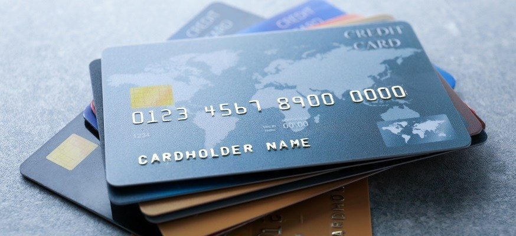

21세기에 사는 인간은 하루에도 일을 하기 위해, 자신의 자격을 증명하기 위해, 또는 내가 어떠한 집단에 속하는지를 밝히기 위해 수십, 수백번의 인증(authentication)과 승인(authorization)을 한다. 주민등록증, 여권, 운전면허증 또는 사원증, 압수수색 영장의 제시 등은 전통적인 인증과 승인 에 속하며, 우리는 이를 정해진 검증 절차 하에서 완전히 신뢰한다. 인터넷과 전자제품 및 생체인증, 안전한 암호화 알고리즘이 보급된 현재 우리는 전통적인 인증 외에도 매우 다양한 전자인증을 한다. 가장 흔하게 접하는 ID와 비밀번호의 조합부터 이메일을 통한 인증, 휴대폰을 통한 인증, 또는 본인의 생체 정보를 이용한 전자인증을 통해 우리는 금융 거래를 하거나, 권한이 필요한 작업을 승인하거나, 자신의 신분을 제3자에게 증명할 수 있다. 그러나 전자인증이 완전히 신뢰 가능한지는 논란이 될 여지가 충분하다. *정보가 털렸다*는 뉴스도 많이 접하지만, 기업이 개인의 인증 정보를 이용해 *허가 없이 개인의 정보를 이용했다*든지[^1], 한 사이트에서의 비밀번호 가로채기로 많은 계정을 한 번에 해킹당한다든지 하는 뉴스도 꽤 다루어진다. 본 글에서는 일반적으로 전자 인증과 승인이 어떠한 방식으로 이루어지는지와 공격이 들어올만한, 혹은 오용될 만한 부분들을 모두 짚어보고 개인이 스스로 개인정보 보호와 인증의 남용을 막기 위해 시도할 수 있는 보안 수칙들을 알아보고자 한다.

# 인증과 승인

## 인증과 승인의 주체

인증과 승인에 대해 자세히 알아보기 전에, 이 두 작업에는 항상 같은 역할을 하는 세 주체가 있어야 한다. 이 주체들은 전통적인 인증에서도 동일하게 적용되기 때문에, 전통적인 인증 몇 가지를 통해 인증을 받는 예시로 들어 설명하도록 한다.

1. 인증과 승인을 집행하는 주체: 자신
2. 인증과 승인을 발급하는 주체: 발급자
3. 인증과 승인을 확인하는 주체: 제3자

1번은 절대다수의 경우 자신이다. 2번의 발급자는 일반적으로 1번이 속한 집단이 된다. 예를 들어 내가 *어떤 국가의 국민임을 인증*하고 싶다면 *내가 속한 국가*만이 이에 대한 인증을 발급할 수 있을 것이며, 해당 기관인 국가는 여권이나 신분증의 형태로 인증을 발급한다. 2번이 없는 인증은 **내가 나 자신임을 내가 인증한다**는, 인증으로서 전혀 가치가 없는 일에 불과하며, 실제로 전자인증의 일종인 SSL[^2]에서도 자가 인증된 인증서는 보안 통신을 위해 사용될 수는 있으나 인증 그 자체로서는 신뢰하지 않는다. 3번은 예를 들면 타국의 입국심사관, 압수수색을 받을 대상, 은행원 등으로 1번의 승인이 있는 경우에만 어떤 작업을 집행할 수 있는 주체이다. 뒤에서 다루겠지만, 전자인증과 승인은 발급자와 제3자 모두에게 남용될 수 있다.

## 인증과 승인의 차이점

**인증**과 **승인**은 종종 혼용되지만, 분명히 구별되는 개념이다. 우리는 승인 없는 인증도 많이 하고 있기 때문에 이 둘을 헷갈리기 쉽지만, 둘은 HTTP 응답 코드도 401과 403으로 구분된다.

### 인증(Authentication)

인증은 **나는 이 사람이다**라고 알리는 행위이다. 주류를 구매하기 위해 신분증을 제시하는 것, 타국에 출입하기 위해 여권을 제시하는 것, 놀이공원 등에 재입장하기 위해 손에 찍힌 도장이나 팔목에 걸린 입장권을 보여주는 것은 인증에 속한다. 전자인증은 이 이상의 행위를 요구하는 경우가 아직까지는 적기 때문에 인증이 이루어지면 대개 **로그인된 사용자에게 주어진 모든 권한이 승인**된 것과 같이 취급하여, 승인과의 구분이 불명확한 부분이 있다. 인증 실패에 대한 HTTP 응답 코드는 401 Unauthorized로, *본 서비스는 당신이 어떤 사용자인지 식별하는 데 실패했음*을 의미하며, 대개 로그아웃된 상태로 로그인된 사용자만 접근할 수 있는 구역에 접근했을 때 발생한다.

### 승인(Authorization)

승인은 **나는 이러한 권한이 있다**라고 알리는 행위이다. 압수수색 영장을 제시하는 것, 사내의 제한된 구역에 접근할 때 출입증 또는 승인된 사원증을 제시하는 것 등은 승인에 해당한다. Google 등을 이용한 인증을 주의깊게 진행하다보면, 해당 서비스가 어떠한 권한을 승인해줄 것인지를 사용자에게 요청하는 부분이 있다. 주로 자신의 이메일 등의 정보를 수집한다고 적혀 있는데, 실제로 더 높은 권한을 요구하는 서비스들은 더 많은 승인을 필요로 하기도 한다. Google 인증 정보는 Google 드라이브에 접근하여 파일 등을 읽고 쓰는 데 사용될 수도 있으며, Google이 수집한 위치 정보에 접근하는 데 사용될 수도 있다. 그렇기 때문에 승인은 각 권한에 대하여 신중하게 이루어져야 한다. 승인 실패에 대한 HTTP 응답 코드는 403 Forbidden으로, *본 서비스는 당신이 누구인지는 식별하였으나 당신이 해당 작업을 하기 위한 권한이 없다고 판단함*을 의마하며, 일반적으로 해당 권한을 발급자로부터 승인받기를 요청한다.

# 승인의 원천

본 글에서 **승인의 원천**으로 표현하고자 했던 의미는 **승인을 위해 자신과 제3자 사이에 주고받는 정보 혹은 근거**인데, 영어 표현인 source of authority에 비해 약간 어색한 것 같다. 잘 쓰이는 단어인지는 모르겠으나, 나는 즐겨 쓰는 표현이다. 인증 또는 승인 정보를 신뢰할 수 있는지는 결국 이 승인의 원천이 양측에서 신뢰 가능한지의 문제로 귀결된다. 자신과 제3자는 모두 해당 승인의 원천을 자신만이 발급할 수 있다는 사실을 신뢰해야 한다. 만약 제3자가 이를 신뢰할 수 없다면 승인으로서 해당 정보는 무의미하며, 자신이 이를 신뢰할 수 없다면 공격자가 언제든 자신임을 흉내내어 제3자에게 접근할 수 있음을 의미하므로 이러한 원천을 통한 승인을 피해야 할 것이다.

전자인증은 다양한 정보들을 승인의 원천으로 활용하며, 이는 전자금융 및 전자승인의 역사에 따라 다양한 방식으로 발전해왔다. 어떤 방식들은 편의성을 추구하기도 했고, 어떤 방식들은 보안성을 추구하기도 했다. 그러나 모든 시도가 긍정적인 결과만을 낳은 것은 아래의 사례들을 보면 명백히 아닌 것으로 보인다. 새로운 인증 방식들은 새로운 논란을 낳았으며, 이에 대한 기술적, 사회적 합의는 현재진행형이다. 이하 인증 및 승인 원천들은 서로 보완적으로 사용되기도 하며, 모두 통신 보안이 보장된 채널을 통한 정보 전달[^3]을 기본 조건으로 한다.

## 고정된 단일 원천

영원히, 혹은 충분히 긴 정해진 시간동안 불변인 값을 이용하여 인증과 승인을 하는 형태이다. 이러한 원천들은 유출되는 순간 자신이 승인한 행위들을 제3자가 임의로 행할 수 있게 되며, 이를 철회할 수도 없으므로 보안성은 최악이다.

### 주민번호

한국은 2000년대 초만 해도 주민번호를 이용한 전자인증이 흔했다. 주민번호만을 이용한 인증이 아니더라도 ID + 비밀번호 등의 조합에서 비밀번호를 주민번호를 이용하여 변경할 수 있는 경우가 많았으며, 이는 사실상 주 인증 방식들의 보안성을 주민번호 수준으로 끌어내림을 의미한다. 심지어 주민번호는 영원하고 특징적이므로, 주민번호만 유출되어도 해당 사람의 거의 모든 개인정보를 터는 것이 어려운 일이 아니었다. 결국 주민번호는 이러한 문제점들의 지적 이후 빠르게 인증 원천으로서의 기능을 잃었고, 원한다면 재발급도 가능하도록 변경되었다. 지금은 남아있는 서비스가 없겠지만, 주민번호를 인증 정보로서 요구하는 서비스는 절대로 이용하지 말자. 당신의 개인정보와 주민번호 쌍이 중국 등지에서 100원 미만에 거래되고 있다는 소문은 기정사실에 가깝다.

### 카드번호

일반적으로 카드번호라고 부르는 16자리 숫자와 유효기간, CVC를 알고 있다면, 해당 카드를 특정할 수 있다. 다시 말해, 이 번호들을 알고 있다면 해당 카드로 인터넷 결제가 가능하다. 이 끔찍한 사실을 생각보다 많은 사람들이 인지하지 못하며, 해외 여러 곳에서 같은 카드를 사용한 여행객들은 카드번호를 이용한 외화 결제로 상당히 큰 금액을 털리곤 한다. 이 쪽이 주민번호보다 사정이 나은 점이라면, 유효기간이 있다는 것, 본인이 만료시킬 수 있다는 것과 실제로는 추가 인증을 요구하는 카드사들이 절대다수라는 것이다[^4]. 삼성페이는 결제 시도 시마다 임시 카드번호를 생성하므로 카드번호로 결제 내역 열람 또는 승인이 불가능하며, 임시 카드번호 생성을 통한 결제는 점점 보급되고 있는 추세이다.

[^5]

## 자신을 특정하는 하나의 값과 비밀 키

전자인증에서 가장 많이 사용하는 방식이고, 전자인증에 한정해서는 전통적이라고 해도 될 만큼 많은 연구와 논의가 이루어진 방식이다. 자신이 비밀번호를 더 강한 인증 하에서[^6] 변경할 수 있다는 점에서 고정된 원천을 이용한 인증보다 훨씬 보안성이 뛰어나다. 그러나 자신이 비밀번호 유출 여부를 확인할 방법이 일반적으로는 없고, 비밀번호가 키보드 입력 도청이나 안전하지 않은 채널을 통한 전송으로 유출되고 나면 비밀번호를 바꾸기 전까지는 고정된 단일 원천과 마찬가지로 공격자에게 모든 권한을 허가한 것이나 마찬가지인 상태가 된다. 자신을 특정하는 키는 일반적으로 알아내기 매우 쉽기 때문에 이 부분은 보안에 전혀 도움이 되지 않는다.

### ID + Password

절대다수의 웹서비스, 심지어는 일부 네트워크 프로토콜들(ssh 등) 조차도 사용자를 특정하는 문자열인 ID와 사용자만이 알고 있는 비밀번호(password)의 조합으로 사용자를 인증 및 승인한다. 요즘은 언급된 단점으로 인해 비밀번호만 사용하는 발급자는 거의 없고, 새로운 기기 또는 위치에서 로그인을 시도하는 경우 아래의 임시 승인을 병행하는 경우가 많다.

### 카드번호 + 비밀번호

인터넷 결제를 보완하기 위한 카드 비밀번호는 일반적으로 네 자리 혹은 여섯 자리의 숫자이다. 무차별 대입 공격에 대한 안전성으로 따지면 자전거 열쇠보다도 못하거나 비슷하다. 이를 막기 위해 비밀번호를 3회 혹은 5회 이상 잘못 입력하면 추가적인 승인이 있을 때까지 인터넷 결제를 정지하는 방법을 많은 카드사들이 채택하고 있으나, 이는 사람들이 비밀번호를 기억하기 쉽도록 여러 카드와 통장에서 돌려쓰도록 하는 원인이 되었다. 다른 곳도 아니고 금융에서 아직도 이렇게 취약한 인증 시스템을 사용하고 있는 것은 기존 금융 시스템의 인증에 대한 몰이해도 원인이지만, 법적으로 더 나은 방안을 쓰는 것을 불허하고 있는 문제도 있다. 요즘은 비밀번호 단독으로 인터넷 결제를 승인하는 카드사는 거의 없고, 카드 비밀번호는 곧 주민번호와 같은 절차로 인증 원천으로서의 지위를 잃을 것이다.

### 공인인증서?

한국 핀테크의 발전을 20년간 가로막고 있는 공인인증서는 디스크에 존재하는 파일과 비밀번호의 조합으로 인증을 발급한다. 사실 방식 자체는 아래에서 언급할 임시 승인을 매번 발급하는 것에 가깝지만, 고정된 식별 정보와 비밀번호를 사용한다는 점에서 여기에 쓴다. 인증서 파일이 디스크에 존재하므로 만천하에 나임을 드러내는 ID보다는 안전하지만, 파일을 복사 또는 탈취하는 것은 아주 쉬운 일이므로 인증서를 나만 들고 있다는 사실은 보안에 그다지 도움이 되지 않는다. 당장 당신이 일생 동안 잃어버리거나 적절한 조치 없이 폐기한 하드 또는 이동식 저장소가 몇 개나 있는지 헤아릴 수 있는가? 비밀번호는 영어 소문자, 숫자와 특수문자로 최대 10자의 조합이며, 전술한 나쁜 비밀번호의 조건을 대부분 만족한다. 이러한 인증서로 관공서와 은행에서 나를 식별하고 있다는 사실이 놀라울 따름이다.

공인인증서가 비밀번호 입력을 통해 생성하는 인증 원천의 보안성은 국내에서 개발한 SEED 알고리즘에 의해 보호되고, 해당 알고리즘의 보안성은 크게 흠 잡을 부분은 없다. 공인인증서가 가장 문제가 되는 부분은 이 파일을 **내 기기에서 어떤 방식으로든 실행해야 한다는 것**이다. 인터넷 브라우저는 일종의 샌드박스로, 브라우저가 돌아가고 있는 기기를 제어할 수 있는 권한이 전무해야 한다. 그런데 브라우저를 통해 인터넷 뱅킹을 하기 위해 공인인증서를 실행하고, 비밀번호를 입력하고, 성공 시 발생한 인증 정보를 다시 브라우저로 보내는 과정은 샌드박스의 범위를 넘어선다. 과거에 이를 해결하기 위해 사용된 기술이 ActiveX였고, 현재는 브라우저 확장 프로그램 및 몇 가지의 설치 프로그램들로 브라우저가 공인인증서를 실행할 수 있도록 하고 있다. 공인인증서가 디스크에 저장된 파일이라는 점과 이를 실행할 추가 응용프로그램들을 설치해야 된다는 점은 공인인증서를 Windows 및 IE11이라는 플랫폼에 종속적으로 만들었고, 핀테크 시대에 끔찍한 사용성과 독점적인 법적 지위를 통해 한국 핀테크의 발전을 단독으로 저지했다. 최근 그 독점적인 지위가 폐지된 이후에도 금융권이 내놓은 인증 방식들을 살펴보면 사실 이 사람들은 공인인증서가 천년만년 사용되기를 원했던 것이 아닐까 싶을 정도로, 혹은 제발 사용자의 정보가 털려서 금융 사고가 벌어졌으면 좋겠다는 생각이 아닌가 싶을 정도로 안일하고 무식하고 허술하기 짝이 없다.

[^7]

이상 살펴본 방식들은 모두 인증 후 인증된 주체에게 허가된 모든 권한을 승인받는 것과 동일하게 취급한다. 이제부터는 비교적 최근에 이용되기 시작하였고, 승인과 철회가 간편하며 보안성도 뛰어난 일회성 승인을 생성하는 방식들을 알아볼 것이다.

## 자신이 직접 발급하는 임시 승인 증명

### 쿠키와 토큰

쿠키와 토큰은 일반적으로 위에서 다룬 ID + PW의 결과물로 발급자가 발급하는 결과물이다. 타 인증 방식을 통한 쿠키와 토큰의 발급과 이들을 이용한 인증은 편의성 측면에서 여러 장점이 있다. 이들은 브라우저 또는 그 밖의 HTTP를 사용하는 클라이언트(모바일 앱 등)에서 현재 사용자를 기억할 수 있는 거의 유일한 방법이다. 따라서 쿠키와 토큰을 쓰지 않는다면 사용자는 권한이 필요한 작업을 하기 위해 모든 요청마다 동일한 인증 정보를 실어 계속 보내야 하고, 이는 생성시마다 다른 값을 반환하는 쿠키와 토큰에 비해 보안 측면에서 좋지 않다.

쿠키와 토큰의 적용 범위가 다른 정보들에 비해 넓다는 것도 하나의 장점이다. 같은 브라우저 내의 모든 탭과 창 간의 쿠키와 토큰들은 모두 공유되며, 따라서 한 탭에서만 로그인하고 나면 다른 탭들에서도 로그인 상태가 유지된다. JS 변수로 인증 정보를 저장한다면 해당 정보는 탭 간에 공유될 수 없을 것이다. 대부분의 쿠키와 토큰들은 스스로 만료 기한을 명시하고 있으며 이는 하나의 쿠키 또는 토큰으로 무한정 승인을 할 수 없게 함으로써 사용자의 클라이언트 또는 쿠키, 토큰 그 자체가 공격자에게 탈취당한 상황에서도 피해를 최소화할 수 있도록 한다.

#### JWT

JWT는 JSON Web Token의 약자이며, 토큰 기반 인증 시대에 발급자와 자신 모두 신뢰할 수 있으면서도 형태가 비교적 자유로운 토큰을 발행하고 사용할 수 있도록 만들어진 명세이다. 기술적인 부분은 생략한다. JWT는 JSON으로 된 내용(body)과 서명으로 이루어지는데 이 서명은 내용을 발급자가 암호화한 것으로 누구나 발급자가 공개한 키로 서명을 복호화할 수는 있지만, 서명을 생성하는 것은 발급자만 가능하다. 제3자는 먼저 서명을 발급자가 공개한 키로 복호화하여 서명이 유효한지 확인하고, 내용에 담긴 정보들을 통해 해당 토큰이 적절한 인증과 승인을 담고 있는지 확인한다.

JWT 이외에도 Redis, 혹은 전통적인 RDBMS 등을 이용한 임시 토큰을 생성, 관리할 수 있다. 그러나 JWT는 서버에 토큰에 대한 정보를 남길 필요가 없다는 점, 제3자가 인증의 유효성을 검사하기 위해 발급자에게 재요청할 필요가 없다는 점에서 장점이 있다. 단점은 토큰 자체가 추가 정보 없이 완전한 인증을 보유하므로 생성한 토큰이 탈취되었을때 이를 만료시킬 방법이 없다. 토큰을 어디에 저장하는 것이 옳은가? 이 문제는 프론트엔드 개발자들의 오래된 논쟁거리이며, 필자의 의견은 별도의 글에서 남겨보도록 하겠다.

### SSO: Single Sign On

쉽게 말해, *OO으로 로그인하기*이다. Google 아이디를 이용해 Notion을 이용하거나, Facebook 아이디를 이용해 Instagram을 이용할 수 있다. Apple 아이디는 OAuth라는 신뢰 가능한 프로토콜 하에서 기존의 발급자가 새 발급자에게 해당 유저를 인증하는 토큰을 보낼 수 있게 되었다. 덕분에 서비스 개발자들은 인증과 관련한 개발 비용을 줄일 수 있게 되었고, 사용자들은 최초 인증 발급자를 신뢰하기만 해도 다양한 중소규모 서비스들을 안전하게 이용할 수 있게 되었다.

#### 인증의 콜백 지옥

그러나 SSO를 통한 인증의 보급이 불러온 새로운 문제점을 무시할 수는 없다. 본디 *콜백 지옥*은 NodeJS에서 쓰이는 안좋은 프로그래밍 패턴을 일컫는 말이지만, 인증에서도 아주 유사한 문제가 벌어진다. 예를 들어 Banana라는 서비스에 내가 Instagram ID를 가지고 로그인했다. 그런데 Instagram은 Facebook으로 로그인했다면, 나는 Banana에 들어갈 때마다 Instagram 로그인 페이지, Facebook 로그인 페이지를 거쳐 Banana로 돌아와야 한다. Banana가 만약 다양한 SSO 인증을 지원한다면 문제는 더 심각해진다. Banana에 들어가서 Google로 로그인하기, Facebook으로 로그인하기, Instagram으로 로그인하기가 모두 떠있다면, 사용자는 들어갈 때마다 자신이 어떤 인증 방식을 썼던 것인지 헷갈릴 것이다.

이는 인증의 제3자 역할을 하던 서비스가 발급자의 역할까지 겸하게 되면서 이 구분이 모호해졌기 때문이다. 제3자 역할의 서비스는 제3자로 남아야 할 것이고 발급자 역할의 서비스는 발급자로 남아야 할텐데, 이는 기술적으로 강제된 사항은 아니므로 어떤 서비스나 원한다면 인증 API를 노출하게 되어 이러한 콜백 지옥이 나타난 것이다. 최근에는 전역적으로 통합된 SSO를 만들겠다는 논의가 이루어지고 있는 것으로 보이는데, 이것이 과연 이루어질 수 있을지, 언제쯤 이루어질지에 대한 기약이나 언급이 거의 없는 상황이다.

### OTP: One-Time Password

일회성으로 아주 짧은 유효기간의 비밀번호를 생성하고 인증이 끝난 즉시 만료시키는 OTP는 자신이 OTP를 받을 수 있는 유일한 주체라는 것만 가정할 수 있다면 최고의 보안성을 자랑한다. 유출되더라도 유출 시점에서 인증으로써 완전히 무의미할 가능성이 높기 때문에 공격자가 자신보다 OTP를 먼저 알 수 있는 상황만 아니라면 여러 보안 문제점들이 원천적으로 봉쇄된다.

#### 2FA: Two-Factor Authentication

2FA, 혹은 MFA(Multi-)는 ID + PW 조합의 보안성을 OTP 형태의 추가 인증 수단으로 강화하기 위해 발급자들이 제공하는 서비스이다. 2FA는 인증 과정의 귀찮음을 크게 올리는 요소들 중 하나이지만, 발급자들은 이전에 로그인한 기록이 있는 기기 또는 브라우저를 기억하고 있다가 새로운 기기에서 시도된 로그인에 한해서만 2FA를 수행하는 방식을 많이 채택하며, 이러한 조치만으로도 계정의 보안성은 크게 올라간다.

- 로그인 QR 코드 또는 로그인 링크
- 이메일로 전송하는 코드
- 문자메시지로 전송하는 코드
- OTP 애플리케이션으로 전송하는 코드
- 새 기기를 등록하기 위해 Apple 기기로 전송하는 코드

# 인증과 승인의 오용 및 공격

전자인증과 승인은 전통적인 인증과 승인과 비교하면 그 역사가 매우 짧고, 기술적인 내용들 때문에 그 정확한 내막을 파악하고 있는 사람은 실제로 이것을 이용하는 사람들에 비해 매우 적다. 전화가 보급되고 보이스피싱이 사회적으로 문제가 되었듯이, 전자인증의 보급 또한 셀 수없이 많은 문제들이 생겨나는 시발점이 되었다. 보안에서의 격언처럼, **모든 과정에서 가장 보안이 약한 부분이 전체 시스템의 보안 수준을 결정한다**. 발급자가 아무리 보안 수칙들을 철저히 지킨다고 해도, 사용자는 최소한의 보안 수칙들을 인지하고 있어야지 만일의 공격에 대비할 수 있다. 만약 발급자도 신뢰할 수 없다면, 사용자는 자신의 정보를 안전하게 지키기 위해 더욱 노력해야 한다.

## 해커의 공격

해커는 당신의 ID와 비밀번호 조합을 알아내기 위해 당신의 통신을 도청하거나 비밀번호를 입력하는 곳에 물리적으로 접근할 수 있다. 비밀번호 또는 이에 상응하는 승인의 원천을 획득하고 나면, 해커는 당신인 척 하여 금융 거래를 하거나 당신의 지인 또는 동료들에게 접근할 수 있다. 해커는 해당 승인의 원천으로부터 주어진 권한 내에서 당신의 작업 내용, 또는 개인 정보를 읽거나, 복사하거나 또는 삭제할 것이다. 혹은 랜섬웨어처럼 해커만이 아는 키로 비밀번호를 바꾸거나 파일들을 암호화하여 이것들을 담보로 당신에게 거래를 시도할 수도 있다.

### 도청

인터넷은 기본적으로 모두에게 열려있고 그 기술적인 기반은 *안전한 통신*이 아닌 *어디서나 가능한 통신*이기 때문에 당신의 통신을 도청하는 것은 케이크를 먹는 것보다 쉽다. 그런데 의외로 이 문제는 간단하게 해결되는데, 네트워크의 양 끝단, 즉 발급자와 자신 측에서 모든 데이터를 암호화 및 복호화하는 것이다. 공개된 네트워크에 진입하기 전에 모든 데이터가 암호화되며 이를 복호화할 수 있는 주체는 둘밖에 없으므로, 도청자가 알 수 있는 내용은 _누가 몇 바이트를 보냈더라_ 정도를 제외하면 없다. 달리 말하면, 보안되지 않은 통신은 당신의 비밀번호를 만천하에 공개하는 것과 같다. HTTP 대신 HTTPS를 사용하는 것만으로도 네트워크를 통한 도청은 원천적으로 차단된다.

### 물리적으로 입력을 관측

어깨 너머로 비밀번호를 입력하는 과정을 지켜보는 방법도 있겠지만, 이러면 물리적으로 제지당할 것이다. 좀 더 기술적으로는 키보드, 마우스, 모니터의 입출력을 도청하는 방식이 가능하다.

#### 가상 키보드?

이를 막기 위해 대부분의 대한민국 금융 기관들은 가상 키보드를 권장하지만, 가상 키보드가 과연 보안 수준을 유의미하게 높일 수 있을까? 만약 키보드 도청으로 인한 보안 문제가 발생했다면, 그것이 금융사, 개발팀 등의 책임일까? 만약 입출력을 관장하는 OS가 하나의 프로그램이 입력을 받는 동안 같은 권한 단계의 다른 프로그램이 그 입력을 동일하게 받을 수 있도록 허가한다면, 이는 OS가 권한 분리를 잘못한 것이다. 만약 소프트웨어가 아니라 하드웨어적으로 백도어가 있다면, 예를 들어 키보드에 백도어 칩이 심어져 있다면, 이는 키보드가 입력 외에 네트워크 통신 등의 기능을 할 수 있도록 권한을 요청해야 함을 의미하며, 이 단계에서 걸러져야 한다. 만약 사용자의 브라우저가 해킹되었다면, 가상 키보드 도청 또한 키보드 도청만큼이나 쉽게 이루어질 수 있으므로 이 경우에도 가상 키보드는 의미가 없다. 마지막으로 커널 영역까지 자유롭게 접근할 수 있는 **관리자 권한**을 사용자가 악성 코드에게 부여했다면, 이것은 사용자 문제이다. 권한 허가 창이 기본적으로 뜨도록 바뀐 윈도우 비스타 이후에는 이러한 수상쩍은 신호들을 못 알아채는게 더 힘들어졌다.

결론적으로 2020년대에 들어서서 가상 키보드로 비밀번호를 입력하는 것이 금융사의 보안 책임 소재를 얼마나 면책해주는지 나는 잘 이해하지 못하겠다. 오히려 이러한 가상 키보드들로 입력하는 비밀번호들의 규칙을 더 강화하거나, 생체인증 등의 편하고 안전한 방식으로 옮기는 것이 금융사와 소비자 모두에게 좋은 해결책이라고 생각한다.

### 서비스를 위조하여 인증 정보를 해커에게 보내도록 변경

간판만 Facebook이고 그 내용물은 해커가 제작한 위조 사이트인 경우, 사용자가 해당 사이트에 자신의 Facebook 인증 정보를 입력하면 해커는 ID와 비밀번호를 아주 쉽게 탈취할 수 있다. 더욱 위험한 점은 웹사이트는 똑같이 만드는 것이 매우 쉽다는 것이다. 코드가 모두에게 오픈되어있기 때문이다. 이를 방지하는 방법은, 예를 들어 Facebook 인증 정보는, 반드시 facebook.com 도메인 하에서만 입력하는 것이다. 위조 사이트들은 도메인은 위조할 수 없기 때문에 비슷한 facedook.com, facebook.co 등의 도메인을 써서 위조 인증 사이트를 띄울텐데, 도메인이 다르다는 것은 이미 이 사이트는 facebook.com 하에서 관리되지 않음을 의미하기 때문에, 거의 100%에 가까운 확률로 위조 사이트이다. 아래의 경우, 사용자는 www.facebook.com.vcsltp.com으로 보내지고 있다. 만일 이런 낚시에 걸렸다면, 즉시 비밀번호를 바꾸고 2FA를 설정하자.

[^9]

### 무차별 대입 공격

도청이 실패하면 해커는 이제 사용자가 자주 사용하는 문자열부터 시작하여 여러 가지 값을 비밀번호 칸에 대입하여 인증이 성공할 때까지 발급자에게 공격을 가할 수 있다. 이는 해커의 입장에서 사실상 최후의 수단이자 가장 연구가 많이 된 수단이기도 하며, 이를 [무차별 대입 공격(brute force attack)](https://en.wikipedia.org/wiki/Brute-force_attack)이라고 한다.

#### 비밀번호의 특정 문자 사용은 보안성을 증가시키는가?

비밀번호에는 꼭 대문자, 특수문자 등을 끼워넣으라는 격언, 권고사항, 또는 강제사항이 있다. 그러나 현재 시점에서 이 규칙은 보안성을 강화시키는 정도는 미미하며 사용자의 귀찮음만 가중시킨다고 결론지어졌다[^8]. 이 규칙은 무차별 대입 공격을 방어하기 위하여 만들어졌으며, 무차별 대입의 방어는 가능한 대입의 경우의 수를 아주 크게 증가시키는 것으로 달성된다. 당신이 네 자리 숫자의 자전거 열쇠를 가지고 있고 자전거 도둑이 이 열쇠를 따고 자전거를 훔치려고 시도한다면, 그리고 자전거 열쇠의 줄 자체를 끊는데 실패했다면, 자전거 도둑은 열쇠의 비밀번호의 가능한 경우를 모두 대입하여 열쇠가 열리는지 확인할 것이다. 숫자가 네 자리이므로 가능한 경우의 수는 0000~9999까지 총 1만개이며, 평균적으로 수 천번의 대입이면 열쇠가 열릴 것이다. 그리고 수 천번의 대입을 수행하는 동안 자전거 주인 또는 경찰이 와서 도둑을 쫒아낼 가능성은 꽤 높으므로, 자전거 열쇠는 네 자리 숫자만으로 그 역할을 다하는 것이다.

전자인증의 암호 무차별 대입은 자전거 열쇠의 대입보다 비교도 안되는 속도로 빠르게 이루어진다. 암호화 알고리즘이 아무리 늑장을 부리더라도 마음만 먹는다면 1초에 수만 번의 대입은 아주 쉽게 이루어진다. 만약 암호가 영어 소문자로만 이루어지고 4자에서 20자 사이라는 정보가 있다면, 영어 소문자는 26종류이므로 공격자가 대입해야 할 경우의 수는 $26^4+26^5+...+26^{20}$이다. 만약 여기에 영어 대문자가 추가된다면 한 글자가 가지는 경우의 수가 26에서 52로 늘어나므로 총 경우의 수는 $52^4+52^5+...+52^{20}$으로 크게 늘어나며, 숫자와 특수문자를 포함하면 더욱 커진다.

그러나 현실적으로 영어 대문자와 특수문자의 사용은 경우의 수를 크게 증가시키지 않았다. 의도대로라면 대문자, 소문자, 숫자, 특수문자가 적절히 섞여 각 자리마다 52가지의 가능성이 존재해야 하지만, 실제로 사람들은 서비스에서 요구하는 요구사항을 맞추기 위해 자신들이 원래 사용하던 영어 소문자와 숫자 조합의 비밀번호의 끝에 특수문자와 대문자를 적절히 섞어넣을 뿐이었고, 결과적으로 경우의 수는 영어 소문자와 숫자 조합의 수에서 그렇게 개선되지 않았음이 밝혀졌다. 더군다나, 이 모든 문자들을 섞어서 쓰는 것보다도 단순히 긴 비밀번호를 사용하는 것이 훨씬 공격에서 안전하다. 영어 대문자, 소문자, 숫자와 특수문자가 섞인 문자열 `P@ssw0rd`보다 영어 소문자로만 이루어진 문자열 `aquickbrownfoxjumpsoveralazydog`가 사용자에게 기억하기도 쉽고, 대입의 경우의 수도 훨씬 높다.

그러므로 새로 가입하는 서비스에서 요구하는 비밀번호 조건들을 만족시키지만 짧은 문자열보다는 기억하기 쉬운 나만의 긴 영소문자 문자열을 생각하고 서비스가 허용하는 비밀번호의 최대 길이에 가까운 비밀번호를 사용하는 것이 보안적으로 더 안전할 것이다.

### 아직 유효한 인증의 원천을 탈취

예를 들면 당신이 로그인하고 잠시 자리를 비운 사이 당신의 인증 정보가 유지되어 있음을 이용하여 권한을 악용하는 것이다. 이는 자신 외에 다른 사람이 자신의 기기를 사용할 가능성이 있는 경우, 자리를 떠나기 전에 로그아웃을 하는 식으로 방지할 수 있고, 발급자는 이를 예방하기 위해 쿠키나 토큰의 유효 기간을 충분히 짧게 설정할 수 있다. 은행 웹사이트들의 세션 시간이 10분 내외인 이유이다. 조금 더 괜찮은 해결 방법으로는 브라우저의 **시크릿 모드**를 이용하는 것이 있다. 이에 대해서는 아래에서 더욱 자세히 설명한다.

## 발급자의 오용

발급자가 매우 두터운 신용과 신망을 가지고 있더라도, 발급자 또한 보안의 신이 아닌 하나의 주체일 뿐이라는 사실을 잊어서는 안된다. 발급자의 인증 정보 오용에 대한 말이 없다면, 그것은 진짜로 그 기업이 안전하게 당신의 정보를 보관하고 있는 것일 수도 있고, 사실은 오용하고 있으나 아직 들키지 않은 것일 수도 있다. 한국의 금융사와 카드사들은 고객의 개인정보를 해커에게 수 차례 털리기도 했고, 심지어는 매매한 곳도 있었다[^10].

### 인증

발급자는 인증의 원천을 발급하기 위해 인증 정보를 받을 때 암호화된 값이라도 이를 복호화할 수 있다. 즉, 발급자는 나의 인증 정보를 평문으로 조회할 수 있는 권한이 있다. 이를 악용할 수 있는지 살펴보자.

#### 발급자는 나의 비밀번호를 아는가?

만약 내가 Google에 어떤 비밀번호를 사용해서 인증하려 한다면, Google은 내가 비밀번호로 입력하는 문자열을 알고 있을까? 많은 사람들은, 그것이 보안적으로 지양해야 함을 알고 있음에도, 많은 사이트의 비밀번호로 동일한 문자열을 사용하고 있을 것이다. 그렇다면 Google은 내가 사용하는 비밀번호르 이용하여 같은 비밀번호로 가입한 모든 사이트에 접근이 가능한가? 혹은 내가 가입한 소규모 웹서비스의 데이터베이스가 털려서 나의 비밀번호가 유출된다면, 역으로 그 사람은 나의 Google 계정을 탈취할 수 있는가?

결론부터 이야기하면 이 문제들에 대해 자신 측에서 취할 수 있는 조치는 거의 없으며, 다만 발급자가 여러 일반적인 보안 수칙들을 철저히 지키고 있기를 기대하는 수밖에 없다. 먼저 비밀번호를 평문으로 저장하는지에 대하여 살펴보면, 발급자는 일단 비밀번호를 암호화된 채널을 통해 평문으로 전달받는다. 이 평문을 그대로 DB에 저장할 수도 있겠으나, 그러면 위에서 언급한 문제들에 바로 노출되므로 일반적으로 아주 어려운 알고리즘을 이용하여 평문 비밀번호를 난독화[^11]하여 저장하고 추후 확인 시에도 난독화된 문자열끼리 비교하여 입력한 비밀번호의 유효성을 검사한다. 이렇게 하면 발급자가 나의 평문 비밀번호를 알지도 못하고, DB가 유출되는 만일의 사태에도 평문 비밀번호를 지킬 수 있다.

문제는 이를 기업이 준수하고 있는지 확인할 방법은 거의 없다는 것이다. Facebook은 2010년대 초반까지 사용자들의 암호를 평문으로 저장하고 있었다고 실토했고[^12], 간편한 암호화 알고리즘들이 대중화되기 전 만들어진 사이트들은 ID와 비밀번호 조합을 쓰더라도 이러한 보안 수칙들을 내부적으로 지키고 있다고 신뢰하기 힘들다. 만약 당신이 모든 서비스에서 동일한 비밀번호를 사용하고 있다면, 가장 보안이 취약한 서비스에서 평문으로 비밀번호가 유출되는 순간 보안 수칙을 준수하고 있는 서비스들의 인증 정보까지도 모두 탈취되는 것이다. 이를 방지하는 방법은 여러 사이트에서 서로 다른 비밀번호를 사용하고 주기적으로 비밀번호를 변경하는 것이지만, 인간의 본성인 **귀찮음**이 이를 방해하기 마련이다.

### 인증의 원천

인증 정보 그 자체보다 악용이 쉽고 많이 이루어지는 부분은 인증을 통해 발급된 승인의 원천의 악용이다. 사용자가 발급을 요청하며 승인한 작업들이 있을 텐데, 이를 넘어서는 범주의 정보를 수집하는 등의 행위가 해당된다. 글 처음에 언급한 Facebook의 쿠키 악용 사태로 이에 대한 논의가 매우 활발하게 이루어졌다.

#### 쿠키 악용

쿠키는 사용자의 요청(예: google.com)에 대한 응답을 돌려줄 때 그 내용과 함께 보내지며, 브라우저는 응답에서 온 모든 쿠키를 일단은 저장한다. 그리고 저장된 쿠키들은 같은 도메인(예: drive.google.com) 하의 사이트들에 방문할 때 자동으로 요청과 함께 서버로 보내진다. 이러한 흐름은 사용자의 편의성을 극대화하기 위해 만들어진 것이었고, 실제로 쿠키는 웹서비스의 사용자 경험을 대폭 개선했다. 그러나 문제는 **사용자는 쿠키를 새로운 요청시마다 매 번 끼워 보내는 것에 동의한 적이 없다**는 것이다. 쿠키는 마치 낙인처럼 내가 웹서핑을 할 때 졸졸 따라다니며 갖가지 서비스에 접속할 때마다 "나는 페이스북 사용자 누구다~"라고 광고하는 효과를 내었다.

기업들이 사용자의 정보를 모으는데 환장하는 이유는 바로 **맞춤형 광고**를 낼 수 있다는 것이다. 내가 모르는 새에 나는 대기업들의 데이터베이스에 내가 방문한 웹사이트들과 관심있는 상품들의 리스트를 뽑아 주었고, 이는 그 회사들 자체도 아주 유용하게 쓸 수 있지만 타 기업에서 돈을 주고 살 수도 있는 것이다. 나는 이러한 정보의 조회, 수집, 그리고 재판매에 한 번도 동의한 적 없음에도 말이다.

미국에서는 쿠키의 사용에 대해 반드시 방문자에게 고지하도록 하는 법안이 생긴 것으로 보인다. 많은 사이트들은 자신들이 쿠키를 어떻게 사용하는지와 이를 수락할 것인지에 대해 알림창을 띄우기 시작했다. 구글 크롬은 급기야 사용자가 웹사이트의 쿠키 전송 및 저장을 거부할 수 있는 기능을 발표했다. 이 부분 역시 쿠키의 흔적을 남기지 않거나 최소한만 저장하는 **시크릿 모드**를 사용하면 많은 부분 해결할 수 있다. 나는 어떤 작업을 할 때마다 편의성과 개인정보 보호 사이에서 적당히 저울질하여 일반 탭을 쓸지 시크릿 탭을 쓸지 결정하는 편이다.

# 생체 인증

생체 인증은 최근에서야 보급되기 시작했지만, 기반이 된 기술에 대한 신뢰가 있는 경우에 한해 가히 궁극의 전자 인증이라고 불릴 만하다. 생체 정보를 제공하는 것은 네 자리 비밀번호를 입력하는 것보다 간편하고, 누구도 복제하거나 위조할 수 없으므로 - 또는 그 위협이 무시할 만큼 작으므로 수십 자리 비밀번호보다 안전하다. 단점이라고 할 만한 점은 생체 인증을 지원하는 기기에 발급이 종속되므로 해당 기기를 항상 휴대하고 다녀야 한다는 점 정도인데, 이는 2FA의 단점과 일맥상통하며 역시 비슷한 보안 수준의 인증 원천들로 보완할 수 있다.

현 시점에서 내가 생각하는 가장 안전하고 범용성있고 간편한 인증 및 승인은 디음과 같다. 모든 사이트에서 사용하는 비밀번호로 랜덤한 문자열을 사용하고, 이를 생체인증으로 보호된 금고에 보관하여 필요할 때마다 생체인증으로 꺼내 쓰는 것이다. 이렇게 하면 앞서 언급된 모든 단점들을 최소한의 노력으로 극복할 수 있다. 삼성 패스와 삼성 인터넷의 조합, iCloud KeyChain 등 생체 인증 기기 제조사가 직접 판매하는 솔루션들도 사용될 수 있을 것이고, 1Password 등 서드 파티 비밀번호 금고를 사용하는 것도 좋을 것으로 보인다.

# 결론

전자인증과 승인, 이와 관련된 공격과 피해 사례, 안전하고 간편한 전자인증에 대해 내가 아는 모든 것을 이 글에 담아보았다. 분량도 블로그를 쓰기 시작한 이래로 가장 많은 것 같다. 최근에는 데이터 3법이나 공인인증서 폐지 등 제도권에서도 전자인증에 대해 우호적인 반응이 나오고 있는 것으로 보이고, 국내 유수 스타트업들은 이러한 흐름에서 편하고 안전한 전자인증 체계, 혹은 핀테크를 만들어낼 수 있을 것이라고 생각한다. ID와 비밀번호를 생체 인증으로 완전히 대체할 수 있는 시대가 하루빨리 다가왔으면 하는 바람이다.

[^1]: [Facebook이 쿠키로 유저들의 개인정보를 수집함](https://epic.org/privacy/facebook/)
[^2]: HTTPS의 근간이 되는 기술이며, 이외에도 다양한 암호화 작업에 보편적으로 사용된다.
[^3]: HTTPS 등. HTTP 등의 보안이 보장되지 않은 채널로 전달하는 정보들은 누가 탈취, 악용해도 이상하지 않으며, 이러한 방법으로 인증 정보를 전달하는 서비스는 이용하면 안된다.
[^4]: 이것도 카드번호 유출로 인한 해외 결제 피해가 심해지고 나서야 만들어졌다. 같은 마스터카드 계열 카드라도 카드사가 인터넷 결제 시 추가 인증을 요구하는 경우 해당 페이지로 리다이렉션되며, 카드의 보안 수준은 해당 페이지가 사용하는 인증 방식으로 결정된다.
[^5]: 이미지 출처: ["Credit Cards vs Debit Cards", HB Retirement](https://www.hbretirement.com/blog/credit-cards-vs-debit-cards)
[^6]: 당연하지만 비밀번호 변경을 위한 인증의 보안 수준은 최소 ID + PW 수준보다는 높아야 한다. 주민번호를 이용한 비밀번호 변경이 근본적으로 잘못된 이유이다.
[^7]: 이미지 출처: ["'21년 독점' 공인인증서 사라진다... 빈 자리는 누가 꿰찰까", 조선비즈](https://biz.chosun.com/site/data/html_dir/2020/05/19/2020051900911.html)
[^8]: [비밀번호 규칙의 창시자가 이를 후회하다](https://gizmodo.com/the-guy-who-invented-those-annoying-password-rules-now-1797643987)
[^9]: 출처: ["WARNING: Fake Facebook login system spam!", Facebook](https://www.facebook.com/notes/eset/warning-fake-facebook-login-system-spam/270313581638/)
[^10]: ["카드3사 개인정보 유출사건 마지막 판결...모두 1인당 10만원씩 배상", 보안뉴스](https://www.boannews.com/media/view.asp?idx=53503&kind=1), ["금융사 직원이 개인정보 빼돌려... 건당 최고 500원에 거래", 한국경제](https://www.hankyung.com/news/article/2014010820061)
[^11]: 흔히 해쉬라고 부르는 단방향 난독화 알고리즘들이 쓰이나, 비밀번호는 그 중요성 때문에 난독화에 걸리는 시간이 길고 일정할 것, 암호학적 소금(salt)을 쳐서 입력할 것 등의 조건이 붙는다. 대표적인 알고리즘으로 pbkdf2, bcrypt, argon2 등이 있다.
[^12]: [관련 기사](https://krebsonsecurity.com/2019/03/facebook-stored-hundreds-of-millions-of-user-passwords-in-plain-text-for-years/). 위 사례와 조합해 보면, 대체 이 기업이 SNS 기업인지 사용자 정보 불법 수집 및 무단 배포 기업인지 헷갈릴 수준이다.
